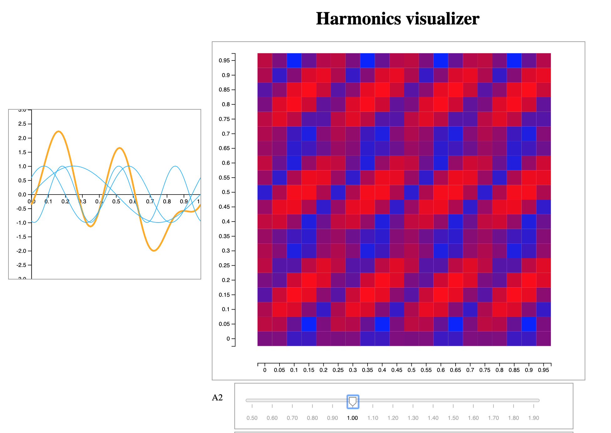

# Harmonic phase space explorer

This project is for me to explore a question about amplitudes of shfited sums
of harmonic sine curves.

Still under construction, but the build instructions are below.

## Python brute-force search

```bash
virtualenv -p python3.7 venv
source venv/bin/activate
python brute_force.py
```

The brute force function computes the max of a large space of sums of three
sine curves at different granularities.  The first two files output are
relatively coarse and take about 30 minutes to generate. The last one uses a
fine granularity and takes about 50 hours to generate on my dinky laptop. I'm
patient.

## D3 visualization

I'm lazy so I clone the same build setup for every viz project, and I have no
idea how gulp and browserify work.

Node version 10.8.0.

```
nvm install 10.8.0
nvm use 10.8.0
yarn install
gulp build  # or gulp watch
```

Right now the url for the data file is hard coded in `main.js`.

Then to view the visualization, build and open `index.html` in your browser.

## Screenshot


